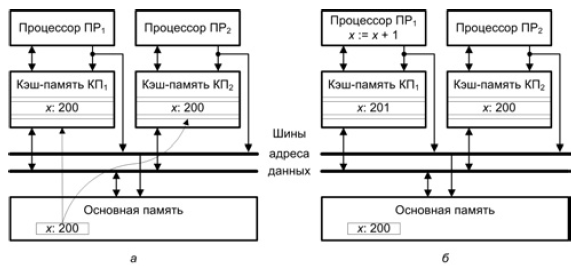
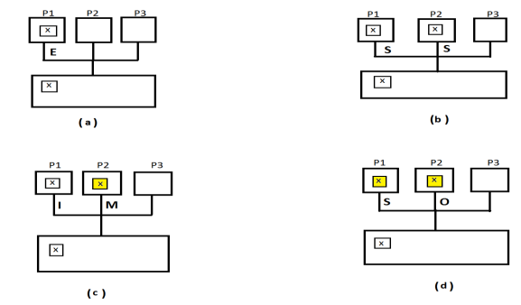

# Мультипроцессорная когерентность кэш-памяти

Мультипроцессорная система с разделяемой памятью состоит из двух или более независимых процессоров, каждый из которых выполняет либо часть большой программы, либо независимую программу. Все процессоры обращаются к командам и данным, хранящимся в разделяемой основной памяти. Поскольку память является общим ресурсом, при обращении к ней между процессорами возникает соперничество, в результате чего средняя задержка на доступ к памяти увеличивается. Для сокращения такой задержки каждому процессору придается локальная кэш-
память, которая, обслуживая локальные обращения к памяти, во многих случаях предотвращает необходимость доступа к разделяемой основной памяти. В свою очередь, оснащение каждого процессора локальной кэш-памятью приводит к так называемой проблеме **когерентности** или **обеспечения согласованности кэш-памяти**.

## Пример

Пусть два процессора `ПР1` и `ПР2` связаны с общей памятью посредством шины. Сначала оба процессора читают переменную `x`. Копии блоков,
содержащих эту переменную, пересылаются из основной памяти в локальные кэши обоих процессоров КП1 и КП2 (рис. а). Далее процессор `ПР1` выполняет операцию увеличения значения переменной `x` на единицу. Так как копия переменной уже находится в кэш-памяти данного процессора, произойдет [**кэш-попадание**](#термины) и значение `x` будет изменено только в `КП1`. Если теперь процессор `ПР2` вновь выполнит операцию чтения `x`, то также произойдет [**кэш-попадание**](#термины) и `ПР2` получит хранящееся в его кэш-памяти «старое» значение `x` (рис. б). [[1]](#источники)

## Подходы

Поддержание согласованности требует, чтобы при изменении элемента данных одним из процессоров соответствующие изменения были проведены в кэш-памяти остальных процессоров, где есть копия измененного элемента данных, а также в общей памяти. В решении проблемы когерентности выделяются два подхода: программный и аппаратный. Аппаратные механизмы преодоления проблемы когерентности принято называть _протоколами когерентности кэш-памяти_. [[1]](#источники)

## Термины

**Кэш-промах** при _чтении_ - процессор делает запрос на чтение из строки, в данный момент **отсутствующей** в его локальной кэш-памяти.

**Кэш-промах** при _записи_ - процессор делает запрос на запись в строку, в данный момент **отсутствующую** в его локальной кэш-памяти.

**Кэш-попадание** при _чтении_ - процессор делает запрос на чтение из строки, в данный момент **находящейся** в его локальной кэш-памяти.

**Кэш-попадание** при _записи_ - процессор делает запрос на запись в строку, в данный момент **находящуюся** в его локальной кэш-памяти.

Повышение быстродействия вычислительной системы достигается в том случае, когда **кэш-попадания** реализуются намного чаще, чем **кэш-промахи**.

## MESI

Протокол назван по названию четырех состояний, в которых может находиться кэш-строка при использовании протокола `MESI`:

* `Modified, M` - модифицированная: данные в кэш-строке были модифицированы, но измененная информация не была переписана в основную память.
* `Exclusive, E` - эксклюзивная: кэш-строка не подвергалась изменению посредством запроса на запись, совпадает с аналогичной строкой в основной памяти, но отсутствует в любом другом локальном кэше.
* `Shared, S` - разделяемая: кэш-строка совпадает с аналогичной строкой в основной памяти и может присутствовать в одном или нескольких других кэшах.
* `Invalid, I` - недействительная: кэш-строка недействительна, не содержит достоверных данных и становится логически недоступной (не используется).

Порядок перехода строки кэш-памяти из одного состояния в другое зависит от:

 1. текущего состояния строки
 2. выполняемой операции (чтение или запись)
 3. результата обращения к строке ([попадание или промах](#термины))
 4. является ли строка совместно используемой или нет [[2]](#источники)

## MOESI

Кроме перечисленных 4-х состояний используется пятое состояние кэш-строки:

* `Owned, O` - находящаяся в собственности: данные одновременно и модифицированы и разделяются (`M` и `S`).

Такое состояние позволяет избежать необходимости записи измененной кэш-строки в основную память, тем самым снижая трафик направленный в основную память. Кэш-строка в таком состоянии содержит более свежие данные. Описанное состояние похоже на `shared` тем, что и другие процессоры тоже могут иметь более свежие по отношению к ОЗУ данные у себя в кэш-памяти. Однако в отличие от `shared` состояние `owned` означает, что данные в ОЗУ устарели. Только один процессор может хранить данные в состоянии `owned`, все остальные процессоры должны хранить данные в состоянии `shared`. Данные все еще необходимо записать в память, но эта запись может быть отложена.

Все описанные состояния представлены на рисунке [[3]](#источники):

Наглядные примеры [[4]](#источники):

(a) `exlcusive`, (b) `shared`, (c) `modified` и `invalid`, (d) `owned` и `shared` состояния после модификации и копирования значения в другие процессоры и ОЗУ.

## Источники

1. Орлов С. А., Цилькер Б. Я. Организация ЭВМ и систем: Учебник для вузов. 2-е изд. — СПб.: Питер, 2011.—688 с.
2. https://studopedia.info/7-40186.html
3. http://wiki.expertiza.ncsu.edu/index.php/Chp8_my
4. https://pdfs.semanticscholar.org/a76d/1fc3af5a1663e2cb296819f27666d571491e.pdf
